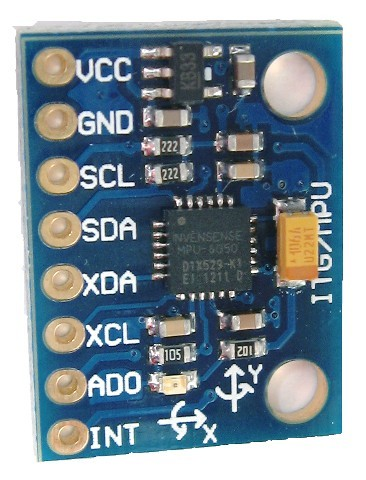
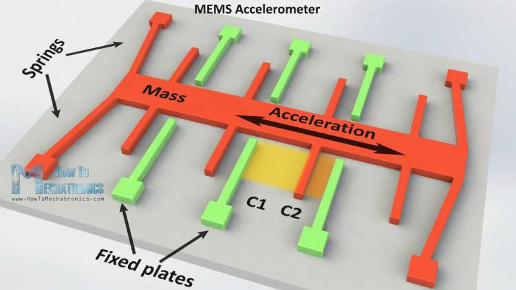
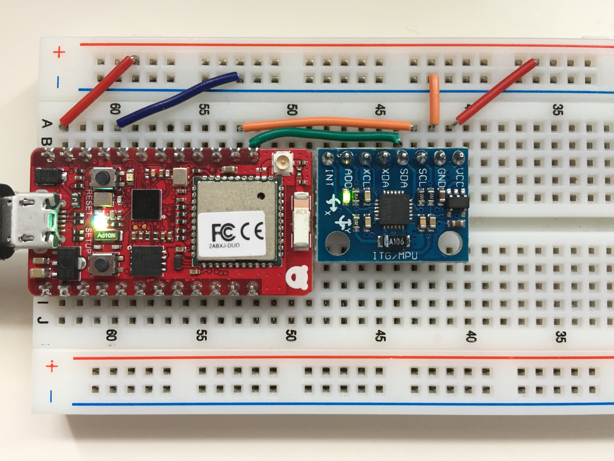
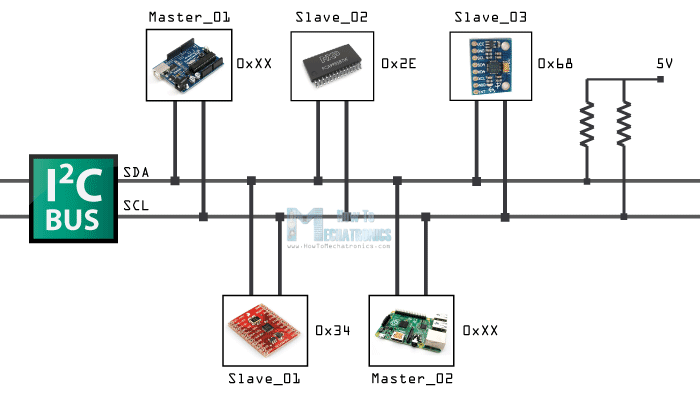

# Sensor 1: Accelerometer Sensor

In today experience we will learn how to use an accelerometer sensor. We are using the sensor [MPU-6050](https://www.invensense.com/wp-content/uploads/2015/02/MPU-6000-Register-Map1.pdf), it is a 6-axis MotionTracking device that combines a 3-axis gyroscope, 3-axis accelerometer, and a Digital Motion Processor™ (DMP) all in a small 4x4x0.9mm package.



Today we will focus only in the accelerometer part (next week in gyro). An accelerometer is a device that measures the proper acceleration. This is not the same as coordinate acceleration (rate of change of velocity). For example, an accelerometer at rest on the surface of the Earth will measure an acceleration due to Earth's gravity, straight upwards (by definition) of g ≈ 9.81 m/s2. By contrast, accelerometers in free fall (falling toward the center of the Earth at a rate of about 9.81 m/s2) will measure zero.

An accelerometer can be implemented by measuring the change in capacitance of a MEMS device. A MEMS (Microelectromechanical systems) micro structure can looks like [this](http://howtomechatronics.com/how-it-works/electrical-engineering/mems-accelerometer-gyrocope-magnetometer-arduino/):



It has a mass attached to a spring which is confined to move along one direction and fixed outer plates. So when an acceleration in the particular direction will be applied the mass will move and the capacitance between the plates and the mass will change. This change in capacitance will be measured, processed and it will correspond to a particular acceleration value.

## Soldering and connecting MPU-6050

Please follow the direction given by instructor to solder the pins for your MPU-6050. After finished, connect the sensor using as a reference the following picture:



## RedBear Code for MPU-6050

In order to read data from a sensor, we can use the library file of that sensor; however, in this case we will do everything from scratch, so you can have an idea of how the communication between your board and sensor works.

The communication between your microcontroller and sensor is by I2C. I2C is an acronym for “Inter-Integrated Circuit”. I2C is a simple and standar data line bus. The data lines travel between various integrated circuits in their products. This reduced the number of wires to two (SDA – data, and SCL – clock). Here is a nice introductory [video](https://www.youtube.com/watch?v=BcWixZcZ6JY) from NXP.




Using I2C communication, the following [code](https://github.com/jpduarteeecs/hardwaremakers/blob/master/labs_sp17/sensor_accgyro/acc_gyro/acc_gyro.ino) can read data from the MPU-6050:

```Arduino
/* Graph I2C Accelerometer On RedBear Duo over Serial Port
 * This example shows how to program I2C manually
 * I2C Pins SDA1==D0, SCL1 == D1
 * Default address: 0x18
 */

// do not use the cloud functions - assume programming through Arduino IDE
#if defined(ARDUINO)
SYSTEM_MODE(MANUAL);
#endif

#define TXRX_BUF_LEN 20

static uint8_t tx_buf[TXRX_BUF_LEN];

uint8_t tx_value[TXRX_BUF_LEN] = {0,};
uint8_t rx_value[TXRX_BUF_LEN] = {0,};

//Declaring some global variables
int16_t gyro_x, gyro_y, gyro_z;
int16_t acc_x, acc_y, acc_z;
int temperature;
long gyro_x_cal, gyro_y_cal, gyro_z_cal;
long loop_timer;
int lcd_loop_counter;
float angle_pitch, angle_roll;
int angle_pitch_buffer, angle_roll_buffer;
boolean set_gyro_angles;
float angle_roll_acc, angle_pitch_acc;
float angle_pitch_output, angle_roll_output;
float auxx,auxy,auxz;

//MPU6050 accelgyro;

int16_t ax, ay, az;
int16_t gx, gy, gz;


void setup() {
  Wire.begin();                                                        //Start I2C as master
  Serial.begin(115200);                                               //Use only for debugging
  pinMode(13, OUTPUT);                                                 //Set output 13 (LED) as output

  setup_mpu_6050_registers();                                          //Setup the registers of the MPU-6050 (500dfs / +/-8g) and start the gyro

  digitalWrite(13, HIGH);                                              //Set digital output 13 high to indicate startup
  digitalWrite(13, LOW);                                               //All done, turn the LED off

  loop_timer = micros();                                               //Reset the loop timer
}

void loop() {
  read_mpu_6050_data();
  //gyro_x -= gyro_x_cal;                                                //Subtract the offset calibration value from the raw gyro_x value
  //gyro_y -= gyro_y_cal;                                                //Subtract the offset calibration value from the raw gyro_y value
  //gyro_z -= gyro_z_cal;                                                //Subtract the offset calibration value from the raw gyro_z value
  auxx=(float)acc_x/4096;
  auxy=(float)acc_y/4096;
  auxz=(float)acc_z/4096;
  Serial.print("a/g:\t");
  Serial.print(auxx); Serial.print("\t");
  Serial.print(auxy); Serial.print("\t");
  Serial.print(auxz); Serial.print("\t");
  Serial.print(gyro_x); Serial.print("\t");
  Serial.print(gyro_y); Serial.print("\t");
  Serial.println(gyro_z);
  delay(100);

}

void read_mpu_6050_data(){                                             //Subroutine for reading the raw gyro and accelerometer data
  Wire.beginTransmission(0x68);                                        //Start communicating with the MPU-6050
  Wire.write(0x3B);                                                    //Send the requested starting register
  Wire.endTransmission();                                              //End the transmission
  Wire.requestFrom(0x68,14);                                           //Request 14 bytes from the MPU-6050
  while(Wire.available() < 14);
  //Wait until all the bytes are received
  acc_x = Wire.read()<<8|Wire.read();                                  //Add the low and high byte to the acc_x variable
  acc_y = Wire.read()<<8|Wire.read();                                  //Add the low and high byte to the acc_y variable
  acc_z = Wire.read()<<8|Wire.read();                                  //Add the low and high byte to the acc_z variable
  temperature = Wire.read()<<8|Wire.read();                            //Add the low and high byte to the temperature variable
  gyro_x = Wire.read()<<8|Wire.read();                                 //Add the low and high byte to the gyro_x variable
  gyro_y = Wire.read()<<8|Wire.read();                                 //Add the low and high byte to the gyro_y variable
  gyro_z = Wire.read()<<8|Wire.read();                                 //Add the low and high byte to the gyro_z variable

}

void setup_mpu_6050_registers(){
  //Activate the MPU-6050
  Wire.beginTransmission(0x68);                                        //Start communicating with the MPU-6050
  Wire.write(0x6B);                                                    //Send the requested starting register
  Wire.write(0x00);                                                    //Set the requested starting register
  Wire.endTransmission();                                              //End the transmission
  //Configure the accelerometer (+/-8g)
  Wire.beginTransmission(0x68);                                        //Start communicating with the MPU-6050
  Wire.write(0x1C);                                                    //Send the requested starting register
  Wire.write(0x10);                                                    //Set the requested starting register
  Wire.endTransmission();                                              //End the transmission
  //Configure the gyro (500dps full scale)
  Wire.beginTransmission(0x68);                                        //Start communicating with the MPU-6050
  Wire.write(0x1B);                                                    //Send the requested starting register
  Wire.write(0x08);                                                    //Set the requested starting register
  Wire.endTransmission();                                              //End the transmission
}

```

## References

* [Arduino Accelerometer & Gyroscope Tutorial MPU-6050 6DOF Module](https://www.youtube.com/watch?v=M9lZ5Qy5S2s)
* [MPU-6050 6dof IMU tutorial for auto-leveling quadcopters with Arduino source code](https://www.youtube.com/watch?v=4BoIE8YQwM8)
* [What is the I2C Bus? An Introduction from NXP](https://www.youtube.com/watch?v=BcWixZcZ6JY)
* [How I2C Communication Works and How To Use It with Arduino](https://www.youtube.com/watch?v=6IAkYpmA1DQ)
