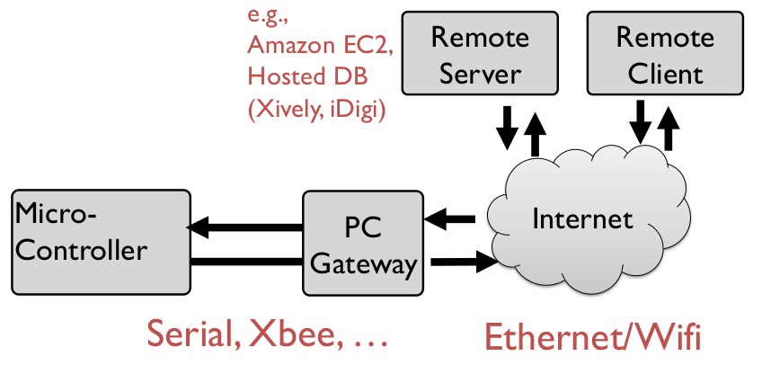
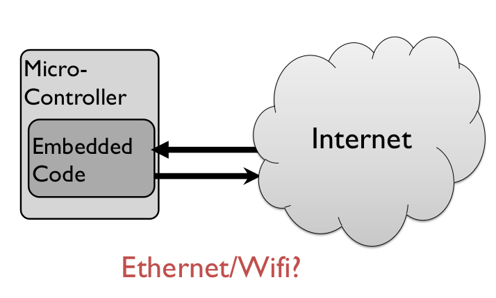
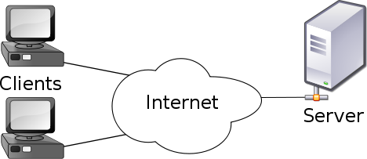

# Connecting Hardware Wireless: Wifi

So far we have been connecting our hardware using wires! All previous labs have been using [serial communication](https://www.youtube.com/watch?v=JJZOTtwpAjA). Indeed, sensors were connected directly to our development board, which sampled the data, and then delivered it to our computers, as the following diagram shows (from [Interactive Device Design](https://bcourses.berkeley.edu/courses/1376830) course):


Today we are going to learn how to establish a wireless communication between your hardware. Depending on what kind of hardware we want to connect, there are several options to achieve wireless communications:  
* XBee Radios
* nRF24L01
* Infrared
* Audio
* Bluetooth
* Wifi

Using one of the previous examples, we can establish the following framework for our hardware implementation (diagram [reference](https://bcourses.berkeley.edu/courses/1376830)):



Where extra services in the cloud can be used, for storing, sharing, and computing data.

Another options is to have your hardware connected directly using WiFi (diagram [reference](https://bcourses.berkeley.edu/courses/1376830)):



## WiFi for Server-Client Model

WiFi is a communication technology for wireless local area networking. It can be use for a Server-Client model, which is a distributed application structure that distributes tasks between servers (offer or deliver a particular service) and clients (request particular service).



For exampple, a printer can be a server which is connected to a wireless network. Then, a computer, the client, send a request to the server, which print your work:


## Creating a Server in a RedBear Duo

We want to send data from our hardware to our PCs. There are several ways to create server-client frameworks that can do this. Today, we will create a server in the RedBear duo that deliver data to any client that connect to it (a client can be coming from your computer or another development board).

Using WiFi technology, available in RedBear Duo and Particle Photon boards, we will connect to a local network. Then, we will create a local server.

Compile and upload the following code to your RedBear Duo board:


```Arduino
#if defined(ARDUINO)
SYSTEM_MODE(SEMI_AUTOMATIC);
#endif

// your network name also called SSID
char ssid[] = "juanito";
// your network password
char password[] = "holahola";

//You choose the number, in this case 23
TCPServer server(23);

boolean alreadyConnected = false; // whether or not the client was connected previously

void printWifiStatus();

void setup() {
  //Initialize serial and wait for port to open:
  Serial.begin(115200);
  // attempt to connect to Wifi network:
  Serial.print("Attempting to connect to Network named: ");
  // print the network name (SSID);
  Serial.println(ssid);

  // Connect to WPA/WPA2 network. Change this line if using open or WEP network:
  WiFi.on();
  WiFi.setCredentials(ssid,password);
  WiFi.connect();

  while ( WiFi.connecting()) {
    // print dots while we wait to connect
    Serial.print(".");
    delay(300);
  }

  Serial.println("\nYou're connected to the network");
  Serial.println("Waiting for an ip address");

  IPAddress localIP = WiFi.localIP();
  while (localIP[0] == 0) {
    localIP = WiFi.localIP();
    Serial.println("waiting for an IP address");
    delay(1000);
  }

  Serial.println("\nIP Address obtained");

  // you're connected now, so print out the status:
  printWifiStatus();

  // start the server:
  server.begin();
}


void loop() {
  // wait for a new client:
  TCPClient client = server.available();

  // when the client sends the first byte, say hello:
  if (client) {
    if (!alreadyConnected) {
      // clead out the input buffer:
      client.flush();
      Serial.println("We have a new client");
      client.println("Hello, client!");
      alreadyConnected = true;
    }

    while (client.connected()){
      client.printf("I am sending data\r");
      delay(33);
    }
  }

}

void printWifiStatus() {
  // print the SSID of the network you're attached to:
  Serial.print("SSID: ");
  Serial.println(WiFi.SSID());

  // print your WiFi shield's IP address:
  IPAddress ip = WiFi.localIP();
  Serial.print("IP Address: ");
  Serial.println(ip);

  // print the received signal strength:
  long rssi = WiFi.RSSI();
  Serial.print("signal strength (RSSI):");
  Serial.print(rssi);
  Serial.println(" dBm");
}
```
